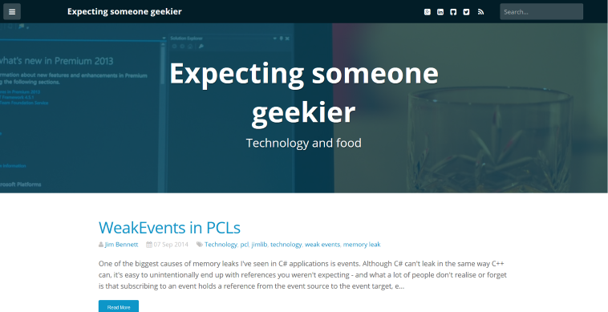

# Faux Ghost


Faux Ghost is a free Ghost theme powered by [Foundation 5](http://foundation.zurb.com), and based on
[Ghostion](https://github.com/axiantheme/ghostion).  This theme is designed to
be responsive, fast and simple.

[Check it out on my blog](http://www.jimbobbennett.io) or see the screenshots below.

Main Page:


Off-Canvas menu:


### Getting started

First you need to make sure you have the following installed:
* [Ruby](https://www.ruby-lang.org/en/installation/)
* [Node.js](http://nodejs.org)

Once these are installed you will need to install the dependencies - Sass, Gulp and Bower.

```
$ gem install sass
$ npm install --save
$ bower install --save
```
You may need to run these using `sudo` depending on your setup.

### Configuring your theme

To generate your theme you need to provide come configuration information that can be used
to set up your blog.  These fields are set in the following files:

```
.\config\config.js
```
This file contains the main configuration for your blog.

More details coming soon.
```
.\config\_variables.scss
```
This file contains the Foundation SASS variables for changing your blog colour scheme.
Details are [available here](http://foundation.zurb.com/docs/v/3.2.5/sass-settings.php)
but essentially any Foundation SASS variable can be tweaked here.

```
.\config\favicons\
```
Put the favicons you want for your blog in this folder.

Image | Size | Description
------|------|--------------
Favicon.ico|16x16, 32x32, 64x64|The main favicon for your blog in .ico format
touch-icon-ipad.png|76x76|Icon when saving a link to an iPad springboard
touch-icon-ipad-retina.png|152x152|Icon when saving a link to a retina iPad springboard
touch-icon-iphone.png|60x60|Icon when saving a link to an iPhone springboard
touch-icon-iphone-retina.png|120x120|Icon when saving a link to a retina iPhone springboard

```
.\config\images
```
This folder contains any images used by your theme configuration.  For example if you put an image
on the off-canvas menu you can reference it here using just the image name (no need for the path).

### Building your theme

Once your theme is configured, build it using:
```
$ gulp release
```

This will build the theme and spit it out as
```
FauxGhost.zip
```
You can then upload this zip using your blog management page (for a hosted blog), or unzip it into the
`content/themes` folder of your ghost install.
